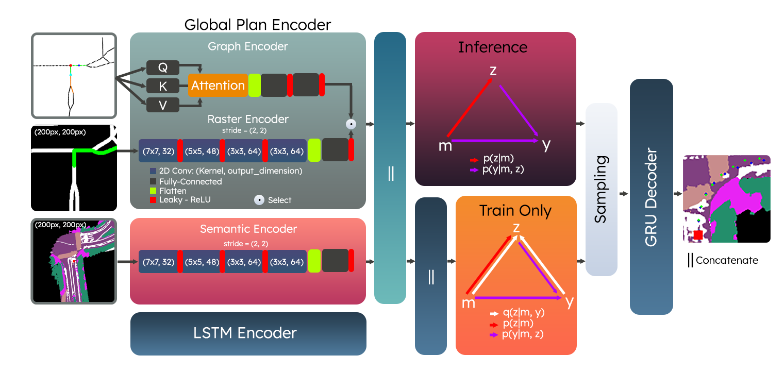

# Data and Experiments for Coarse CGMs in Dynamic Planning

## Datasets
* Download [NominalScenes](https://drive.google.com/drive/folders/1sHL1hh_gBBriyBOuQ1blqvVvubpqG74N?usp=drive_link)
* Download [IntersectionScenes](https://drive.google.com/drive/folders/1spyOoi_g2GQg7SEd6TtMEsofiMxbgJde?usp=drive_link)

## Reference Model


An attention-based CVAE reference model is provided as baseline located under the `att-cvae` directory. 


The code associated with this repository corresponds to the following research work. If you find it useful for research, please consider citing our work.

```
@inproceedings{paz22tridentv2,
 address = {Philadelphia, PA},
 author = {David Paz and Hao Xiang and Andrew Liang and Henrik Iskov Christensen},
 booktitle = {Intl Conf of Robotics and Automation (ICRA)},
 month = {May},
 organization = {IEEE},
 pages = { },
 title = {TridentNetV2: Lightweight Graphical Global Plan Representations for Dynamic Trajectory Generation },
 year = {2022}
}
```

```
@inproceedings{paz21:tridentnet,
 address = {Singapore},
 author = {David Paz and Henry Zhang and Henrik I Christensen},
 booktitle = {Intelligent Autonomous Systems-16},
 month = {June},
 note = {(Best paper)},
 title = {TridentNet: A Conditional Generative Model for Dynamic Trajectory Generation},
 year = {2021}
}
```Reference
```

## Acknowledgements

Various design considerations of this implementation are inspired by the CVAE and prediction literature, including [Trajectron++](https://arxiv.org/abs/2001.03093) and [Learning Structured Output Representation using Deep Conditional Generative Models](https://papers.nips.cc/paper_files/paper/2015/hash/8d55a249e6baa5c06772297520da2051-Abstract.html). We also appreciate the feedback and comments provided by members of the Autonomous Vehicle Lab. We also thank the University of California, San Diego for providing campus access for the data collection process completed in this study. 
